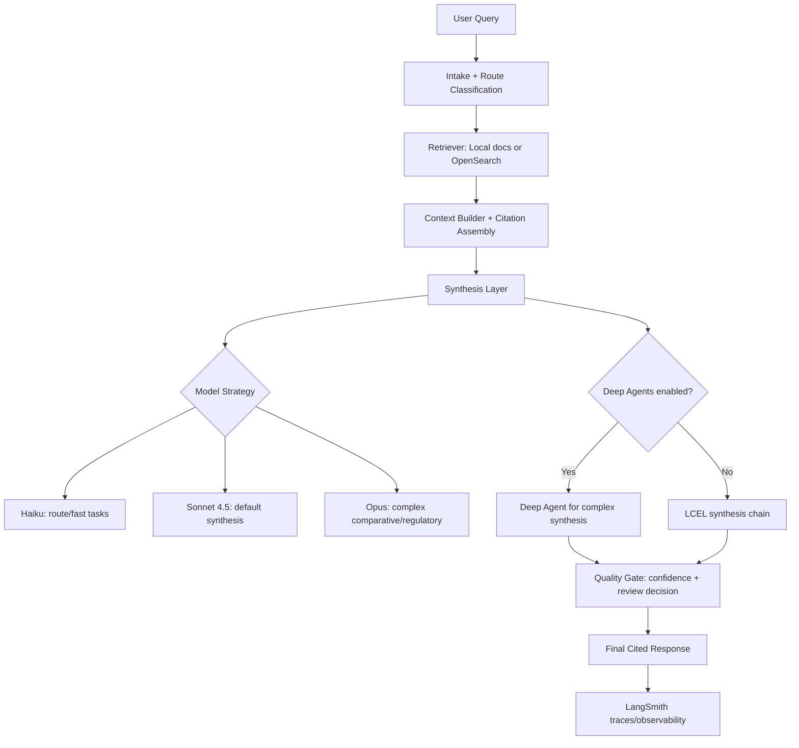
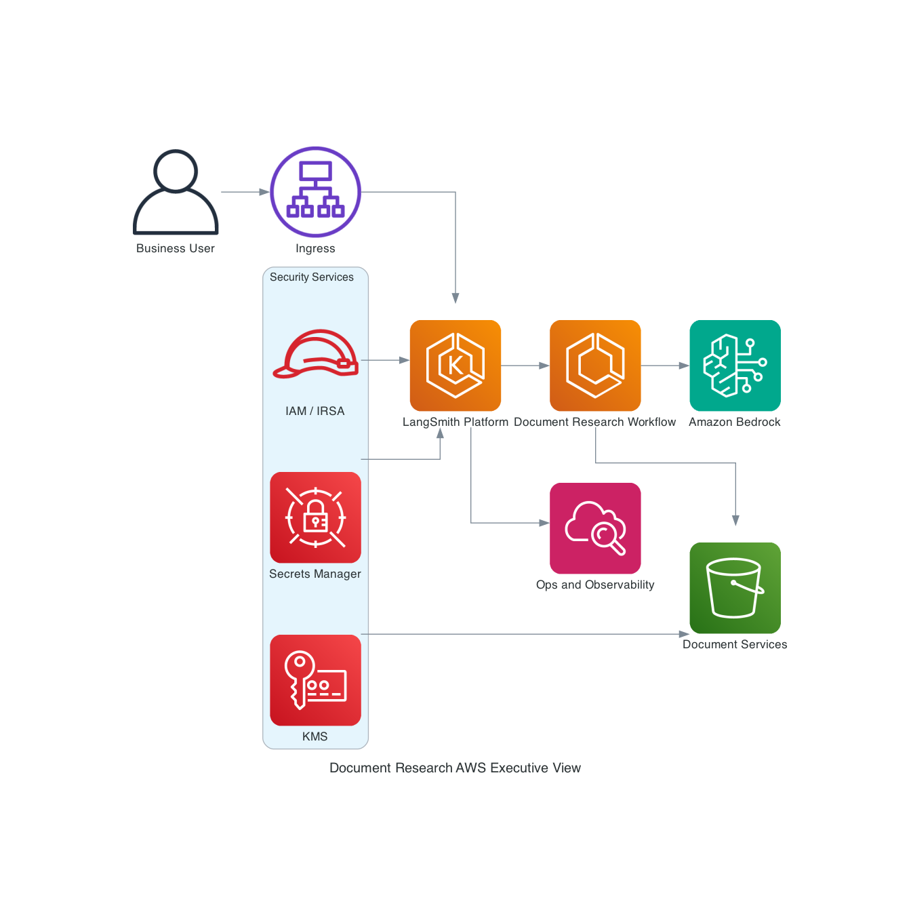

# Document Research Agent (Financial Services)

**Business problem (brief):** Operations and compliance teams need fast, evidence-backed answers from large policy and procedure corpora while preserving traceability, citation quality, and human-review controls.

This sample answers document-based financial operations/compliance questions with:

- query routing
- retrieval over policy/procedure documents
- cited synthesis (LLM mode or deterministic fallback mode)
- confidence scoring and human-review gating
- LangSmith-compatible tracing configuration
- LangChain v1 + LangGraph v1 orchestration
- Optional Deep Agents pattern for complex comparative/regulatory synthesis

## 🗂️ Project Structure

```text
document-research-agent/
├── .env.example
├── requirements.txt
├── run_demo.py
├── sample_data/docs/
└── src/
    ├── config.py
    ├── graph.py
    ├── llm.py
    ├── retrieval.py
    └── state.py
```

## 🏗️ High-Level Architecture



**Legend**
- Default path: `Intake -> Retrieve -> LCEL Synthesis -> Quality Gate -> Final Response`
- Optional path: `Deep Agent for complex synthesis` when `ENABLE_DEEPAGENTS=true`
- Model tiers: Haiku (routing), Sonnet 4.5 (default synthesis), Opus (highest complexity)

## 🚀 Quick Start

```bash
cd financial-services/document-research-agent
python -m venv .venv
source .venv/bin/activate
pip install -r requirements.txt
cp .env.example .env
python run_demo.py --query "What is the wire transfer exception policy for high value requests?"
```

To enable Deep Agents path:

```bash
export ENABLE_DEEPAGENTS=true
python run_demo.py --query "Compare policy changes across versions."
```

## ✅ What to Expect When Setup Is Correct

After setup is successful, a run should show these outcomes:

- The workflow executes end-to-end in order: `route -> retrieve -> synthesize -> quality gate -> final cited response`.
- The run completes without dependency/import/config failures.
- Output includes answer text with source-grounded citations and a confidence/review signal.
- Deep Agents behavior appears only when `ENABLE_DEEPAGENTS=true`.
- If tracing is enabled, the run appears in your LangSmith project with stage-level trace visibility.

### 🔎 Quick Verification Checklist

```bash
# 1) Run a baseline query
python run_demo.py --query "What changed in KYC onboarding requirements between 3.1 and 3.2?"

# 2) Run with Deep Agents enabled (optional path)
ENABLE_DEEPAGENTS=true python run_demo.py --query "Compare policy changes across versions."
```

Expected validation signals:

- No startup/import errors.
- Response includes cited policy/procedure evidence.
- Confidence/review gating output is present.
- LangSmith traces are visible when `LANGSMITH_TRACING=true`.

## ❓ Example Queries

- `What changed in KYC onboarding requirements between 3.1 and 3.2?`
- `What is required before escalating an AML alert?`
- `Compare sanctions screening remediation expectations across policy and SOP guidance.`

## ☁️ AWS Architecture Diagram



Generated using `awslabs.aws-diagram-mcp-server`.
This diagram reflects a full self-hosted LangSmith-on-AWS style at high level:

- `LangSmith Platform` grouped as a single block (UI/API, deployments, observability, evaluations).
- Document research workflow as a LangGraph runtime workload.
- Core integrations to Amazon Bedrock and document services.
- Security controls grouped separately (IAM/IRSA, KMS, Secrets Manager).

## 🧩 AWS Services Used (Reference Architecture)

This sample runs locally by default, but it is designed to map directly to AWS-managed components for production workloads.

| Capability | Local Sample | AWS Service (Production) |
| --- | --- | --- |
| LangSmith platform (observability + evals) | Hosted LangSmith SaaS APIs | Self-hosted LangSmith UI/API/backend on Amazon EKS |
| LangSmith platform storage | SaaS-managed stores | Amazon RDS (PostgreSQL), ElastiCache (Redis), ClickHouse, Amazon S3 |
| LangSmith deployment control + runtime | LangGraph local process | LangSmith control plane + Agent Server data plane on EKS |
| LLM inference | Anthropic via API key | Amazon Bedrock (`Claude` models) |
| Orchestration/runtime | LangGraph in-process | LangGraph runtime on ECS/EKS/Lambda |
| Document storage | `sample_data/docs` | Amazon S3 |
| Document parsing/OCR | N/A in local demo | Amazon Textract |
| Retrieval index | In-memory lexical retrieval | Amazon OpenSearch (vector + keyword hybrid) |
| Metadata/audit state | In-memory state | Amazon DynamoDB |
| Monitoring/tracing | LangSmith | LangSmith + CloudWatch/X-Ray |
| Secrets management | `.env` file | AWS Secrets Manager + IAM roles |

## 🛠️ Recommended AWS Production Flow

1. Store source documents in Amazon S3.
2. Parse PDFs/forms with Amazon Textract.
3. Index chunks and metadata in Amazon OpenSearch.
4. Run the agent on Bedrock models with model sizing by task (Haiku/Sonnet/Opus).
5. Persist case metadata and decisions in DynamoDB.
6. Route logs/metrics to CloudWatch and traces to LangSmith.

## 📈 LangSmith Observability and Evaluations

Use LangSmith to monitor citation quality, response correctness, and review gating behavior over time.

### 1) 🧪 Enable tracing for this sample

```bash
export LANGSMITH_TRACING=true
export LANGSMITH_API_KEY=your_langsmith_api_key
export LANGSMITH_PROJECT=document-research-agent
```

### 2) 🔍 What to inspect in traces

- Route decision correctness (query type and complexity path).
- Retrieval quality (relevant chunks, citation coverage, and context construction).
- Synthesis quality (grounded answer, no unsupported claims).
- Quality gate consistency (confidence score and human-review decision).
- Latency/cost by stage and by model tier.

Recommended trace metadata/tags:

- `query_type`, `policy_domain`, `requires_review`
- `model_tier` (`haiku`, `sonnet`, `opus`)
- `deepagents_enabled` (`true`/`false`)
- `workflow_version`

### 3) 🗃️ Build an evaluation dataset

Include representative scenarios:

- Straight lookup questions (single document/source).
- Comparative questions (policy version deltas).
- Cross-document synthesis questions (policy + SOP alignment).
- Ambiguous/noisy queries that should trigger cautious responses or review.

Store expected outcomes per example:

- Expected answer facts and required citations.
- Expected review decision threshold behavior.
- Expected failure-safe behavior when evidence is insufficient.

### 4) 📏 Suggested evaluation metrics

- Citation correctness/coverage.
- Answer factual accuracy against source text.
- Review-gate precision/recall (when to escalate to human review).
- End-to-end latency and per-stage latency.
- Token/cost per run by model tier.

### 5) 🔁 Regression strategy

1. Run baseline and candidate versions on the same dataset.
2. Compare citation quality, factual accuracy, review-gate behavior, and latency/cost.
3. Block promotion if citation grounding or risk controls regress.
4. Use trace diffs to localize regressions to routing, retrieval, synthesis, or gating.

## 📝 Notes

- If `ANTHROPIC_API_KEY` is unset, the sample runs in deterministic fallback mode.
- Model sizing strategy:
  - Haiku for route classification
  - Sonnet 4.5 for standard synthesis (default)
  - Opus for complex comparative/regulatory synthesis
- Deep Agents integration:
  - Sonnet 4.5 / Opus for high-context complex synthesis
- This sample is intentionally transparent and modular so teams can replace local retrieval with enterprise search backends.
- Python 3.11 or 3.12 is recommended for the best library compatibility.

