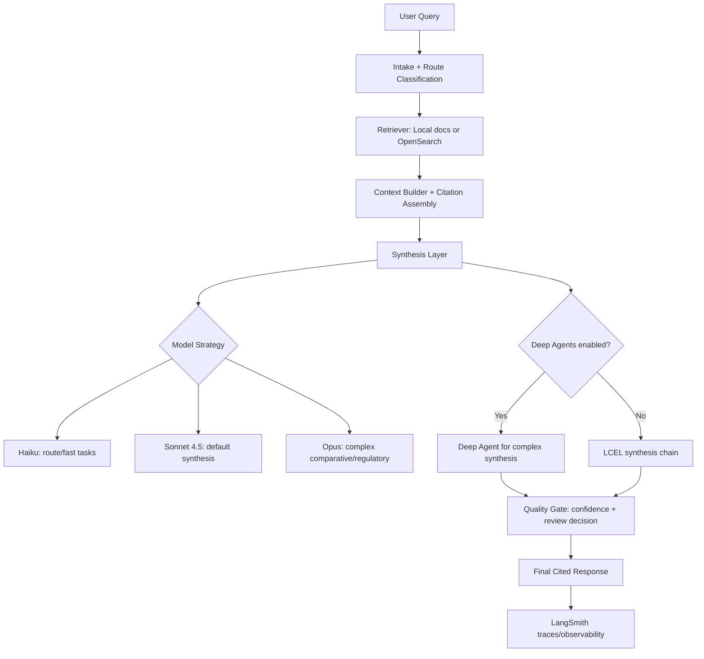

# Document Research Agent (Financial Services)

This sample answers document-based financial operations/compliance questions with:

- query routing
- retrieval over policy/procedure documents
- cited synthesis (LLM mode or deterministic fallback mode)
- confidence scoring and human-review gating
- LangSmith-compatible tracing configuration
- LangChain v1 + LangGraph v1 orchestration
- Optional Deep Agents pattern for complex comparative/regulatory synthesis

## Project Structure

```text
document-research-agent/
├── .env.example
├── requirements.txt
├── run_demo.py
├── sample_data/docs/
└── src/
    ├── config.py
    ├── graph.py
    ├── llm.py
    ├── retrieval.py
    └── state.py
```

## High-Level Architecture



**Legend**
- Default path: `Intake -> Retrieve -> LCEL Synthesis -> Quality Gate -> Final Response`
- Optional path: `Deep Agent for complex synthesis` when `ENABLE_DEEPAGENTS=true`
- Model tiers: Haiku (routing), Sonnet 4.5 (default synthesis), Opus (highest complexity)

## Quick Start

```bash
cd financial-services/document-research-agent
python -m venv .venv
source .venv/bin/activate
pip install -r requirements.txt
cp .env.example .env
python run_demo.py --query "What is the wire transfer exception policy for high value requests?"
```

To enable Deep Agents path:

```bash
export ENABLE_DEEPAGENTS=true
python run_demo.py --query "Compare policy changes across versions."
```

## Example Queries

- `What changed in KYC onboarding requirements between 3.1 and 3.2?`
- `What is required before escalating an AML alert?`
- `Compare sanctions screening remediation expectations across policy and SOP guidance.`

## AWS Services Used (Reference Architecture)

This sample runs locally by default, but it is designed to map directly to AWS-managed components for production workloads.

| Capability | Local Sample | AWS Service (Production) |
| --- | --- | --- |
| LLM inference | Anthropic via API key | Amazon Bedrock (`Claude` models) |
| Orchestration/runtime | LangGraph in-process | LangGraph runtime on ECS/EKS/Lambda |
| Document storage | `sample_data/docs` | Amazon S3 |
| Document parsing/OCR | N/A in local demo | Amazon Textract |
| Retrieval index | In-memory lexical retrieval | Amazon OpenSearch (vector + keyword hybrid) |
| Metadata/audit state | In-memory state | Amazon DynamoDB |
| Monitoring/tracing | LangSmith | LangSmith + CloudWatch/X-Ray |
| Secrets management | `.env` file | AWS Secrets Manager + IAM roles |

## Recommended AWS Production Flow

1. Store source documents in Amazon S3.
2. Parse PDFs/forms with Amazon Textract.
3. Index chunks and metadata in Amazon OpenSearch.
4. Run the agent on Bedrock models with model sizing by task (Haiku/Sonnet/Opus).
5. Persist case metadata and decisions in DynamoDB.
6. Route logs/metrics to CloudWatch and traces to LangSmith.

## Notes

- If `ANTHROPIC_API_KEY` is unset, the sample runs in deterministic fallback mode.
- Model sizing strategy:
  - Haiku for route classification
  - Sonnet 4.5 for standard synthesis (default)
  - Opus for complex comparative/regulatory synthesis
- Deep Agents integration:
  - Sonnet 4.5 / Opus for high-context complex synthesis
- This sample is intentionally transparent and modular so teams can replace local retrieval with enterprise search backends.
- Python 3.11 or 3.12 is recommended for the best library compatibility.

