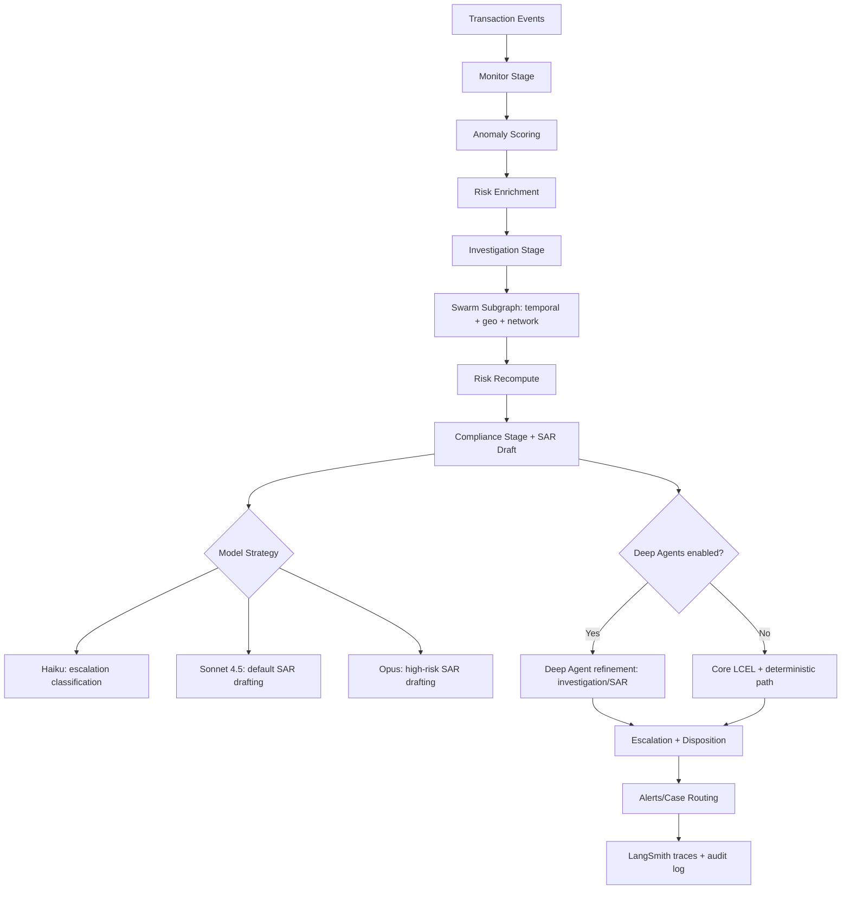
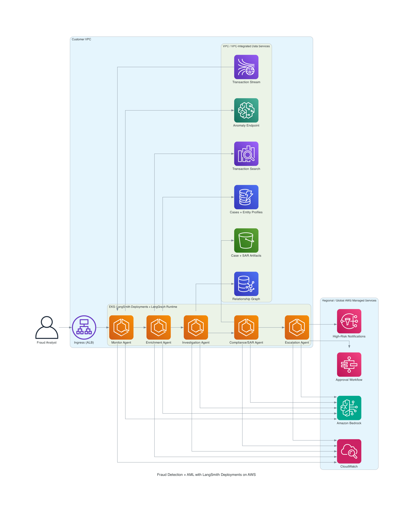

# Fraud Detection & AML Agent

This sample implements:

- Sequential workflow: monitor -> enrich -> investigate -> comply -> escalate
- Swarm-style investigation subgraph for multi-signal finding generation
- SAR draft generation with LangChain and deterministic fallback
- Full case state output for audit and testing
- Optional Deep Agents path for complex investigation and SAR refinement

## Quick Start

```bash
cd financial-services/fraud-detection-agent
python3 -m venv .venv
source .venv/bin/activate
pip install -r requirements.txt
cp .env.example .env
python run_demo.py
```

To enable Deep Agents path:

```bash
export ENABLE_DEEPAGENTS=true
python run_demo.py
```

## Run With JSON Output

```bash
python run_demo.py --json
```

## Project Layout

```text
fraud-detection-agent/
├── src/
│   ├── graph.py
│   ├── state.py
│   ├── agents/
│   ├── subgraphs/
│   ├── tools/
│   ├── models/
│   └── rag/
├── sample_data/
├── tests/
└── run_demo.py
```

## High-Level Architecture



**Legend**
- Default path: `Monitor -> Enrich -> Investigate/Swarm -> Compliance -> Escalation`
- Optional path: `Deep Agent refinement` in investigation/compliance when `ENABLE_DEEPAGENTS=true`
- Model tiers: Haiku (escalation triage), Sonnet 4.5 (default drafting), Opus (high-risk drafting/refinement)

## AWS Architecture Diagram



Generated using `awslabs.aws-diagram-mcp-server`.
This diagram follows the LangSmith AWS self-hosted reference pattern, with `LangSmith Deployments` and the `LangGraph` runtime inside the customer VPC, and direct per-agent calls from each LangGraph stage to Amazon Bedrock.
It is structured against the AWS Well-Architected Framework pillars:

- **Operational excellence**: CloudWatch and X-Ray for workload telemetry and run-time operations.
- **Security**: WAF, IAM roles, KMS encryption, and Secrets Manager for workload protection.
- **Reliability**: Route 53 health checks and SQS DLQ/replay path for failure handling.
- **Performance efficiency**: Auto Scaling and Compute Optimizer for right-sized throughput.
- **Cost optimization**: AWS Budgets to enforce spend controls for model and data services.
- **Sustainability**: Compute Optimizer and elastic scaling to reduce over-provisioned resources.

## AWS Services Used (Reference Architecture)

This sample executes locally, but each stage maps to AWS-native services for production deployment.

| Workflow Stage | Local Sample | AWS Service (Production) |
| --- | --- | --- |
| Streaming ingestion | `sample_data/input_events.json` | Amazon Kinesis Data Streams |
| Anomaly scoring | Rule-based heuristic | Amazon SageMaker endpoint |
| Customer enrichment | Local JSON lookup | Amazon DynamoDB |
| Transaction search | Local JSON history | Amazon OpenSearch |
| Network analysis | Local JSON graph | Amazon Neptune |
| LLM analysis and drafting | Anthropic via API key | Amazon Bedrock (`Claude` models) |
| Orchestration | LangGraph in-process | LangGraph runtime on ECS/EKS/Lambda |
| Alerts/escalation | Console notifications | Amazon SNS + Step Functions |
| Compliance/audit persistence | In-memory state | Amazon DynamoDB + S3 |
| Monitoring/tracing | Local logs + LangSmith | CloudWatch + LangSmith + X-Ray |

## Recommended AWS Production Flow

1. Ingest transaction events via Kinesis.
2. Score anomalies with SageMaker and enrich customer/counterparty context from DynamoDB/OpenSearch.
3. Run graph/network checks in Neptune for relationship risk indicators.
4. Execute LangGraph workflow on Bedrock with Haiku/Sonnet/Opus model sizing.
5. Publish high-risk alerts to SNS and drive approvals with Step Functions.
6. Store case artifacts and SAR outputs in DynamoDB/S3 with CloudWatch observability.

## Notes

- For production, replace local JSON data sources with DynamoDB/OpenSearch/Neptune integrations.
- Model sizing strategy:
  - Haiku for fast escalation classification
  - Sonnet 4.5 for standard SAR narrative drafting (default)
  - Opus for high-risk/critical SAR narrative drafting
- Deep Agents integration:
  - Sonnet 4.5 for deep investigation summarization
  - Opus for high-risk SAR refinement
- For best dependency compatibility, use Python 3.11 or 3.12.

