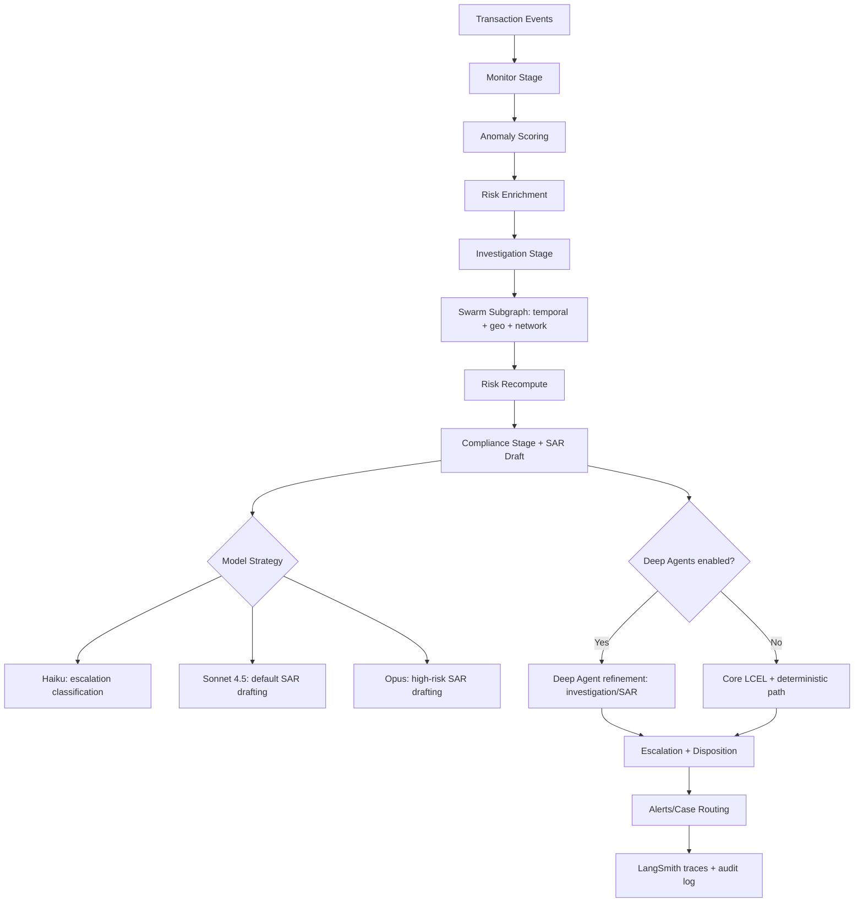

# Fraud Detection & Anti-Money Laundering (AML) Agent

AML stands for **Anti-Money Laundering**: controls and investigations that detect, assess, and escalate potentially illicit financial activity.
SAR stands for **Suspicious Activity Report**: a formal compliance report filed when activity appears potentially linked to fraud, money laundering, or other financial crime.

**Business problem (brief):** Financial institutions must detect suspicious activity early, reduce false positives, and produce auditable, regulator-ready case narratives (for example, SAR-style reporting) without slowing analyst operations.

This sample implements:

- Sequential workflow: monitor -> enrich -> investigate -> comply -> escalate
- Swarm-style investigation subgraph for multi-signal finding generation
- SAR draft generation with LangChain and deterministic fallback
- Full case state output for audit and testing
- Optional Deep Agents path for complex investigation and SAR refinement

## ✅ Prerequisites

- Python `3.11` or `3.12` (recommended for dependency compatibility)
- `pip` and virtual environment support (`python3 -m venv`)
- Optional:
  - Anthropic API key for live LLM responses
  - LangSmith API key for trace upload and evaluation workflows

Check your version:

```bash
python3 --version
```

## 🚀 Quick Start

```bash
cd financial-services/fraud-detection-agent
python3 -m venv .venv
source .venv/bin/activate
pip install -r requirements.txt
cp .env.example .env
python run_demo.py
```

By default, `.env.example` disables LangSmith upload (`LANGCHAIN_TRACING_V2=false`) so first runs stay local/noiseless.
Enable tracing only after setting a valid `LANGCHAIN_API_KEY`.

To enable Deep Agents path:

```bash
export ENABLE_DEEPAGENTS=true
python run_demo.py
```

## 🧾 Run With JSON Output

```bash
python run_demo.py --json
```

`--json` mode suppresses console alert printing by default so the output remains valid JSON.

## ✅ What to Expect When Setup Is Correct

After setup is successful, a demo run should show these outcomes:

- The workflow executes end-to-end in order: `monitor -> enrich -> investigate -> comply -> escalate`.
- The run completes without import/config errors (for example, missing dependencies or invalid environment variables).
- Console output includes a final case result with risk/escalation fields and SAR-style compliance narrative content.
- `--json` mode returns structured output suitable for downstream automation and testing.
- If `LANGCHAIN_TRACING_V2=true` and `LANGCHAIN_API_KEY` is valid, the run appears in your LangSmith project with stage-level trace spans for debugging and evaluation.
- If `ENABLE_DEEPAGENTS=true`, investigation/compliance refinement paths are included in the run behavior.

### 🔎 Quick Verification Checklist

```bash
# 1) Run the demo and verify workflow completion
python run_demo.py

# 2) Run structured mode and verify JSON output
python run_demo.py --json

# 3) (Optional) Verify Deep Agents path
ENABLE_DEEPAGENTS=true python run_demo.py --json
```

Expected validation signals:

- No startup/import errors.
- Final output contains risk classification, escalation decision, and SAR-style narrative fields.
- JSON output is parseable and includes full case state.
- With `LANGCHAIN_TRACING_V2=true` and a valid `LANGCHAIN_API_KEY`, the run is visible in the `fraud-detection-agent` LangSmith project.

## 🗂️ Project Layout

```text
fraud-detection-agent/
├── src/
│   ├── graph.py
│   ├── state.py
│   ├── agents/
│   ├── subgraphs/
│   ├── tools/
│   ├── models/
│   └── rag/
├── sample_data/
├── tests/
└── run_demo.py
```

## 🏗️ High-Level Architecture



**Legend**
- Default path: `Monitor -> Enrich -> Investigate/Swarm -> Compliance -> Escalation`
- Optional path: `Deep Agent refinement` in investigation/compliance when `ENABLE_DEEPAGENTS=true`
- Model tiers: Haiku (escalation triage), Sonnet 4.5 (default drafting), Opus (high-risk drafting/refinement)

## ☁️ AWS Architecture Diagram


Generated using `awslabs.aws-diagram-mcp-server`.
This diagram now reflects a **full self-hosted LangSmith on AWS** pattern (not only deployments):

- **LangSmith platform on EKS**: UI, API, backend services, observability, and evaluation/experiment workloads.
- **LangSmith deployments data plane**: Agent Server/LangGraph runtime for fraud workflow execution.
- **Platform datastores**: PostgreSQL (operational data), Redis (queue/cache), ClickHouse (traces/feedback), and S3 (artifacts).
- **Per-agent Bedrock calls**: each LangGraph stage can call Amazon Bedrock directly based on model-routing policy.
- **Observability and evaluations**: traces, feedback, and experiment outputs flow into LangSmith platform storage and UI.

The structure aligns with LangChain documentation for self-hosted AWS architecture, observability, and evaluation models.
It is structured against the AWS Well-Architected Framework pillars:

- **Operational excellence**: CloudWatch and X-Ray for workload telemetry and run-time operations.
- **Security**: WAF, IAM roles, KMS encryption, and Secrets Manager for workload protection.
- **Reliability**: Route 53 health checks and SQS DLQ/replay path for failure handling.
- **Performance efficiency**: Auto Scaling and Compute Optimizer for right-sized throughput.
- **Cost optimization**: AWS Budgets to enforce spend controls for model and data services.
- **Sustainability**: Compute Optimizer and elastic scaling to reduce over-provisioned resources.

## 🧩 AWS Services Used (Reference Architecture)

This sample executes locally, but each stage maps to AWS-native services for production deployment.

| Workflow Stage | Local Sample | AWS Service (Production) |
| --- | --- | --- |
| LangSmith platform (observability + evals) | Hosted LangSmith SaaS APIs | Self-hosted LangSmith UI/API/backend on Amazon EKS |
| LangSmith platform storage | SaaS-managed stores | Amazon RDS (PostgreSQL), ElastiCache (Redis), ClickHouse, Amazon S3 |
| LangSmith deployment control + runtime | Local process execution | LangSmith control plane + Agent Server data plane on EKS |
| Streaming ingestion | `sample_data/input_events.json` | Amazon Kinesis Data Streams |
| Anomaly scoring | Rule-based heuristic | Amazon SageMaker endpoint |
| Customer enrichment | Local JSON lookup | Amazon DynamoDB |
| Transaction search | Local JSON history | Amazon OpenSearch |
| Network analysis | Local JSON graph | Amazon Neptune |
| LLM analysis and drafting | Anthropic via API key | Amazon Bedrock (`Claude` models) |
| Orchestration | LangGraph in-process | LangGraph runtime on ECS/EKS/Lambda |
| Alerts/escalation | Console notifications | Amazon SNS + Step Functions |
| Compliance/audit persistence | In-memory state | Amazon DynamoDB + S3 |
| Monitoring/tracing | Local logs + LangSmith | CloudWatch + LangSmith + X-Ray |

## 🛠️ Recommended AWS Production Flow

1. Ingest transaction events via Kinesis.
2. Score anomalies with SageMaker and enrich customer/counterparty context from DynamoDB/OpenSearch.
3. Run graph/network checks in Neptune for relationship risk indicators.
4. Execute LangGraph workflow on Bedrock with Haiku/Sonnet/Opus model sizing.
5. Publish high-risk alerts to SNS and drive approvals with Step Functions.
6. Store case artifacts and SAR outputs in DynamoDB/S3 with CloudWatch observability.

## 📈 LangSmith Observability and Evaluations

Use LangSmith to monitor each fraud case end-to-end and measure whether escalation and SAR outputs are improving over time.

### 1) 🧪 Enable tracing for this sample

Set these variables before running:

```bash
export LANGCHAIN_TRACING_V2=true
export LANGCHAIN_API_KEY=your_langsmith_api_key
export LANGCHAIN_PROJECT=fraud-detection-agent
```

Then run the sample as usual:

```bash
python run_demo.py --json
```

### 2) 🔍 What to inspect in traces

For each run, validate:

- **Workflow progression**: `monitor -> enrich -> investigate -> comply -> escalate` completes with no skipped stage.
- **Model routing correctness**: Haiku/Sonnet/Opus choice matches case severity and complexity.
- **Tool/data usage**: enrichment and graph checks use expected sources and produce consistent case context.
- **Escalation reasoning quality**: high-risk decisions include clear, auditable explanation.
- **Latency and cost hotspots**: identify slow or expensive stages, especially investigation and SAR drafting.

Recommended trace metadata/tags for filtering:

- `case_id`, `risk_level`, `escalation_required`
- `model_tier` (`haiku`, `sonnet`, `opus`)
- `deepagents_enabled` (`true`/`false`)
- `workflow_version`

### 3) 🗃️ Build an evaluation dataset for this use case

Create a dataset of representative financial scenarios, for example:

- Low-risk normal activity (should not escalate)
- Medium-risk unusual behavior (needs investigation, may not escalate)
- High-risk patterns (must escalate, requires strong SAR narrative)
- Edge cases (missing fields, conflicting signals, noisy inputs)

Store expected outcomes per case:

- Expected `risk_level`
- Expected `escalation_required`
- Expected SAR quality criteria (coverage of parties, timeline, and rationale)

### 4) 📏 Suggested evaluation metrics

Track metrics that map to AML operations:

- **Escalation precision/recall** (avoid false negatives and false positives)
- **Risk classification accuracy** (low/medium/high correctness)
- **SAR narrative quality** (completeness, factual grounding, actionability)
- **Latency per stage** and **end-to-end runtime**
- **Token/cost per run**, segmented by model tier

### 5) 🔁 Regression strategy for model and prompt changes

When changing prompts, model defaults, or Deep Agents usage:

1. Run the evaluation dataset on baseline (`main`) and candidate versions.
2. Compare escalation precision/recall, SAR quality, and latency/cost.
3. Block promotion if high-risk recall drops or SAR quality regresses.
4. Use trace diffs to pinpoint whether regressions come from enrichment, investigation, or compliance stages.

## 📝 Notes

- For production, replace local JSON data sources with DynamoDB/OpenSearch/Neptune integrations.
- Model sizing strategy:
  - Haiku for fast escalation classification
  - Sonnet 4.5 for standard SAR narrative drafting (default)
  - Opus for high-risk/critical SAR narrative drafting
- Deep Agents integration:
  - Sonnet 4.5 for deep investigation summarization
  - Opus for high-risk SAR refinement
- For best dependency compatibility, use Python 3.11 or 3.12.

